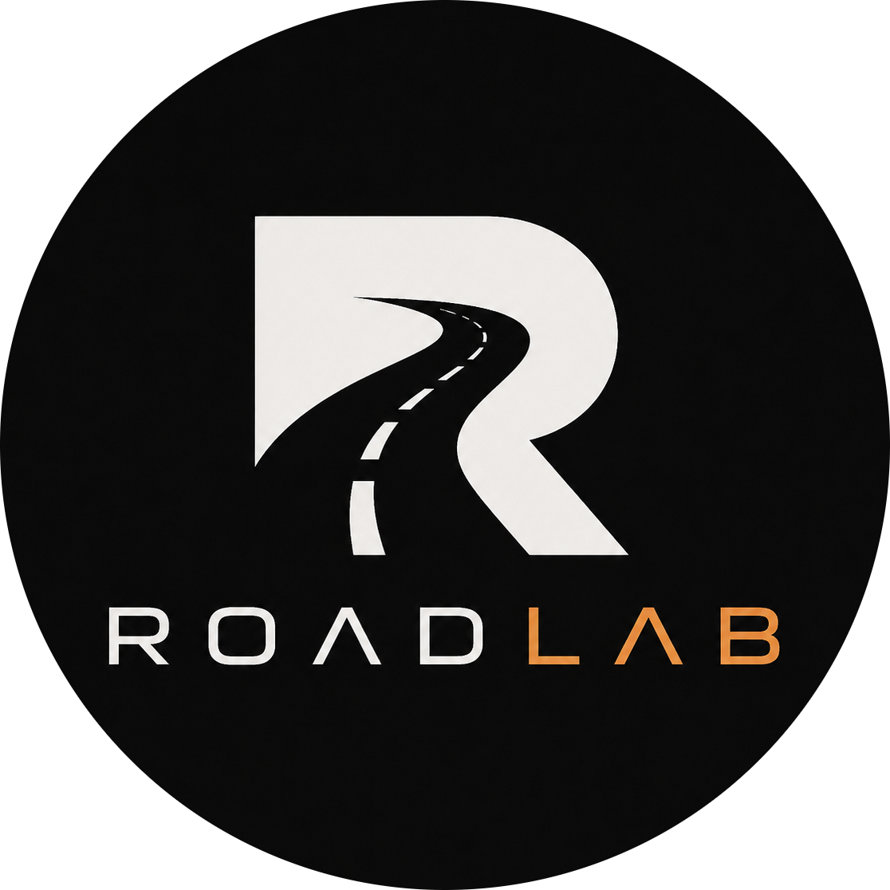

  

<h1 align="center">RoadLab</h1>

RoadLab is a C++ project built with Unreal Engine, focused on recreating real-world road networks in a fully navigable 3D environment.

The project aims to import geographic map data from real sources (such as OpenStreetMap and other mapping providers), process road topology, and generate accurate drivable roads, intersections, and urban layouts inside Unreal Engine.

RoadLab is currently in an early development stage and primarily serves as a technical sandbox for:

- Real-world road data import
- Procedural road mesh generation
- Intersection reconstruction
- Road graph processing
- Large-scale 3D world streaming
- Future vehicle simulation and driving gameplay

## Current Goals

- Parse real-world map data
- Reconstruct road networks in 3D
- Generate clean intersections and junctions
- Support scalable city-sized environments
- Build a solid technical foundation for future driving simulation

## Tech Stack

- **Engine:** Unreal Engine 5.7.4
- **Language:** C++
- **Target Platform:** Windows (primary)
- **Version Control:** Git

## Project Status

Early prototype phase.

Current focus is on architecture, data import pipelines, and road generation systems before gameplay systems are introduced. 

## Planned Features

- OpenStreetMap integration
- Road lane generation
- Roundabouts and complex intersections
- Terrain integration
- AI traffic simulation
- Vehicle physics testing
